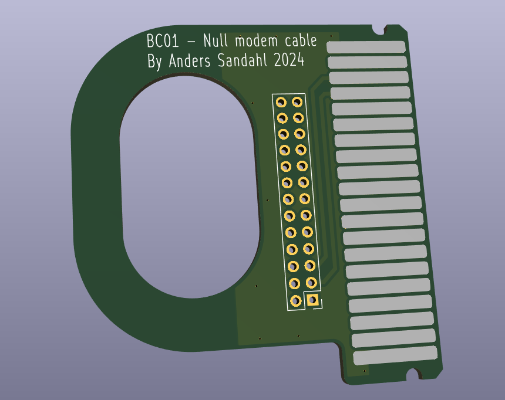
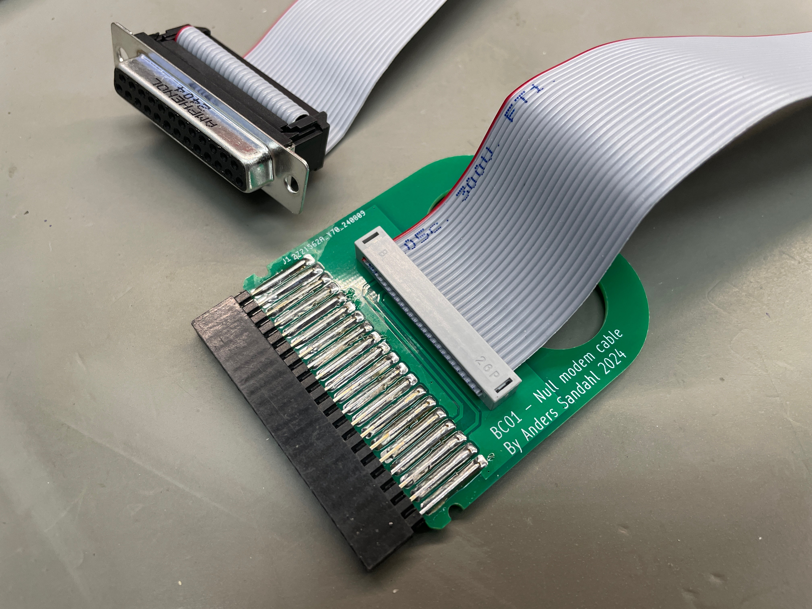
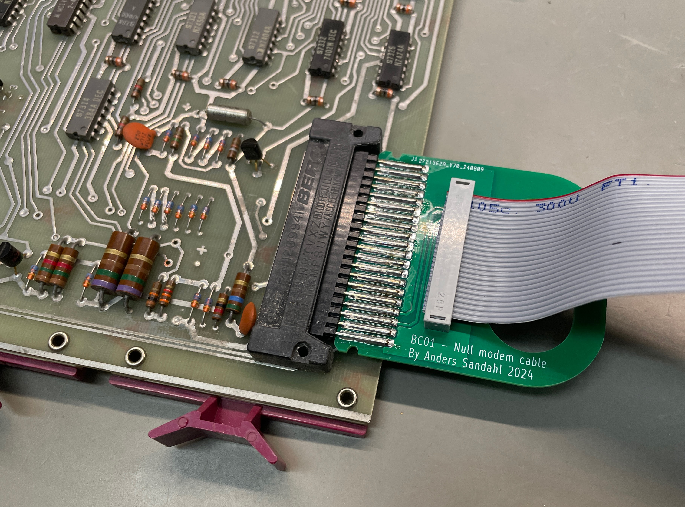

# BC01 Null modem cable

This is a little PCB that on a easy way to build a DEC BC01 cable. It has a handle which makes ir easy to install and remove. It has been tested with DKC8-A, KL8E and KL8JA and fits in PDP8/A and PDP8/E.

